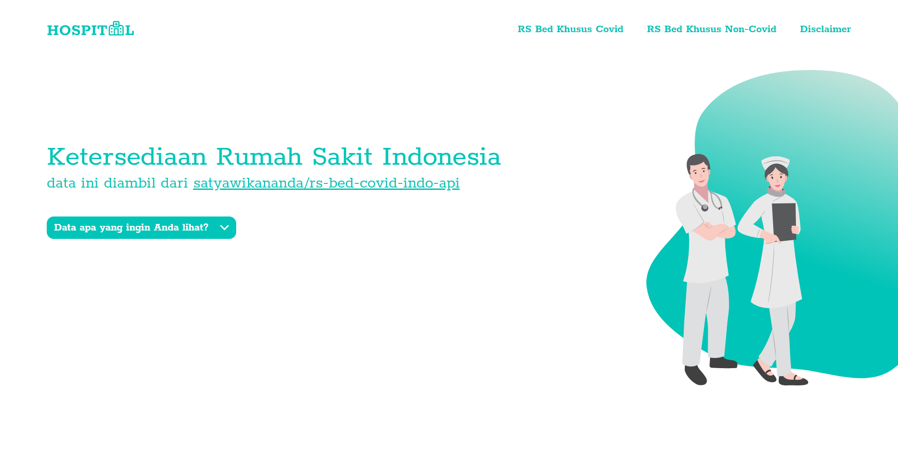

# Availability Indonesia Hospital Bed



A site that give you information about the availability hospital bed for either covid or non-covid in Indonesia.

## Getting Started

1. Clone this repository <br />
   ```
   git clone https://github.com/ajiyudhanto/availability-id-hospital-bed.git
   ```
2. Download all dependencies <br />
   ```
   yarn install / npm install
   ```
4. Run project <br />
   ```
   yarn dev / npm run dev
   ```

## Main Tech

- [Next.js](https://nextjs.org/)
- [Material UI](https://material-ui.com/)
- [Leaflet](https://react-leaflet.js.org/)

## Feature

- [x] Display hospital list based on province and city.
- [x] Show hospital details and coordinate.

## Data Source

Data source of this project is based on public API: [satyawikananda/rs-bed-covid-indo-api](https://github.com/satyawikananda/rs-bed-covid-indo-api).
